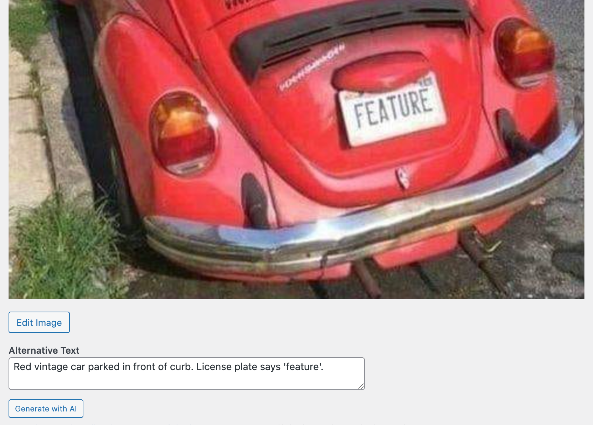

# AI Alt Text

Generate alt text for images using AI. Supports multiple AI providers including OpenAI, Claude, Gemini, Ollama, Azure OpenAI, and Grok.



## Features


- **Bulk Update**: Update alt text for multiple images at once from the media library
- **Block Editor Integration**: Generate alt text directly from the image block in the editor
- **Multiple AI Providers**: Choose from OpenAI (GPT-4o), Anthropic Claude, Google Gemini, Azure OpenAI, Ollama (local), or Grok
- **Language Detection**: Automatically uses WordPress language settings for generated alt text
- **Flexible Configuration**: Configure via constants, environment variables, or the admin settings page

## Requirements

- WordPress 6.8 or higher
- PHP 8.3 or higher
- API key for your chosen AI provider (except Ollama which runs locally)

## Installation

- **Quick Install**

   - Download [`ai-alt-text.zip`](https://github.com/soderlind/ai-alt-text/releases/latest/download/ai-alt-text.zip)
   - Upload via  Plugins > Add New > Upload Plugin
   - Activate the plugin.
   - Go to **Settings → AI Alt Text** to configure your AI provider

- **Composer Install**

   ```bash
   composer require soderlind/ai-alt-text
   ```

- **Updates**
   * Plugin [updates are handled automatically](https://github.com/soderlind/wordpress-plugin-github-updater#readme) via GitHub. No need to manually download and install updates.


## Configuration

### Via Admin Settings

Navigate to **Settings → AI Alt Text** and configure:

1. Select your AI provider
2. Enter your API key
3. Optionally customize the model and other settings

### Via Constants (wp-config.php)

```php
// AI Provider: 'openai', 'anthropic', 'gemini', 'azure', 'ollama', 'grok'
define( 'AI_ALT_TEXT_PROVIDER', 'openai' );

// API Key
define( 'AI_ALT_TEXT_API_KEY', 'your-api-key-here' );

// Optional: Custom model
define( 'AI_ALT_TEXT_MODEL', 'gpt-4o' );

// Azure-specific settings
define( 'AI_ALT_TEXT_AZURE_ENDPOINT', 'https://your-resource.openai.azure.com' );
define( 'AI_ALT_TEXT_AZURE_DEPLOYMENT', 'your-deployment-name' );

// Ollama-specific settings
define( 'AI_ALT_TEXT_OLLAMA_HOST', 'http://localhost:11434' );
```

### Via Environment Variables

```bash
AI_ALT_TEXT_PROVIDER=openai
AI_ALT_TEXT_API_KEY=your-api-key-here
AI_ALT_TEXT_MODEL=gpt-4o
```

## Usage


### Bulk Update

1. Go to **Media → Library** (list view)
2. Select images you want to update
3. Choose "Generate AI Alt Text" from the bulk actions dropdown
4. Click "Apply"

### From the Block Editor

1. Add or select an image block
2. In the sidebar, find the "AI Alt Text" panel
3. Click "Generate Alt Text with AI"

## AI Providers

| Provider | Model | Notes |
|----------|-------|-------|
| OpenAI | gpt-4o | Requires API key from [OpenAI](https://platform.openai.com/) |
| Anthropic | claude-sonnet-4-20250514 | Requires API key from [Anthropic](https://console.anthropic.com/) |
| Google Gemini | gemini-2.0-flash | Requires API key from [Google AI Studio](https://aistudio.google.com/) |
| Azure OpenAI | gpt-4o | Requires Azure subscription and deployment |
| Ollama | llava | Free, runs locally. Install from [ollama.ai](https://ollama.ai/) |
| Grok | grok-2-vision-1212 | Requires API key from [xAI](https://x.ai/) |

For detailed configuration instructions, see [AI Provider Documentation](docs/AI-PROVIDERS.md).

## Hooks & Filters

### Modify Generated Alt Text

```php
add_filter( 'ai_alt_text_generated', function( $alt_text, $attachment_id ) {
    // Modify the generated alt text
    return $alt_text;
}, 10, 2 );
```

### Customize the AI Prompt

```php
add_filter( 'ai_alt_text_prompt', function( $prompt, $language ) {
    // Customize the prompt sent to the AI
    return $prompt;
}, 10, 2 );
```

### Skip Auto-generation for Specific Images

```php
add_filter( 'ai_alt_text_should_generate', function( $should_generate, $attachment_id ) {
    // Return false to skip auto-generation
    return $should_generate;
}, 10, 2 );
```

## Translations

The plugin is translation-ready. Translation files are located in the `languages/` directory.

### Creating a Translation

1. Copy `languages/ai-alt-text.pot` to `languages/ai-alt-text-{locale}.po`
   - Example: `ai-alt-text-nb_NO.po` for Norwegian Bokmål
   - Example: `ai-alt-text-de_DE.po` for German
2. Translate the strings using [Poedit](https://poedit.net/) or similar tool
3. Save to generate the `.mo` file
4. For JavaScript translations, run:
   ```bash
   wp i18n make-json languages/
   ```

### Available Locales

Contributions welcome! Submit your translation via a pull request.

## Development

### Building Assets

```bash
npm install
npm run build
```

### Running Tests

```bash
# JavaScript tests
npm test

# PHP tests
./vendor/bin/phpunit
```

### Code Standards

```bash
# Check PHP code standards
./vendor/bin/phpcs

# Fix PHP code standards
./vendor/bin/phpcbf
```

## License

GPL v2 or later. See [LICENSE](LICENSE) for details.

## Credits

Developed by [Per Soderlind](https://soderlind.no).

## Support

- [GitHub Issues](https://github.com/soderlind/ai-alt-text/issues)

